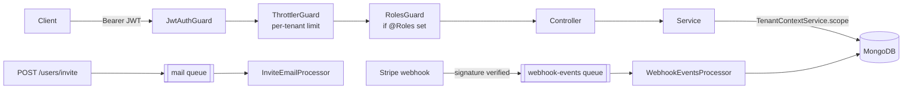

# Stackwell

A multi-tenant SaaS backend boilerplate built with NestJS, MongoDB, and AWS. Demonstrates tenant isolation, JWT auth with RBAC, Stripe billing, per-tenant rate limiting, background job processing, and serverless deployment — the pieces a real multi-tenant product needs beyond single-tenant CRUD.

**Status: feature-complete for its scope.** Every module below is built, tested, and live-verified against real Docker Mongo/Redis. This is a portfolio/learning project, not a maintained production service — see [Known limitations](#known-limitations) for the honest gaps before treating it as one.

## Contents

- [Why this project](#why-this-project)
- [Architecture](#architecture)
  - [Tenant isolation](#tenant-isolation)
  - [Auth & RBAC](#auth--rbac)
  - [Request lifecycle](#request-lifecycle)
  - [Modules](#modules)
  - [Deployment model](#deployment-model)
  - [Rate limiting](#rate-limiting)
  - [Billing](#billing)
  - [Background jobs](#background-jobs)
- [Project structure](#project-structure)
- [Local development](#local-development)
- [Testing](#testing)
- [Cost notes](#cost-notes)
- [Known limitations](#known-limitations)

## Why this project

Most backend portfolio projects are single-tenant CRUD apps. Stackwell instead tackles the problems that show up once you have to serve multiple customers from one deployment: keeping their data apart, scoping auth and rate limits per customer, and billing them — while staying deployable at zero infrastructure cost.

## Architecture

### Tenant isolation

Stackwell uses a **shared database, tenant-scoped by field** rather than a database-per-tenant model. Every tenant-owned document carries a `tenantId`. A request-scoped `TenantContextService` (`src/modules/common/tenant-context.service.ts`) reads the tenant from the authenticated JWT and exposes a `scope()` helper that every tenant-owned query is built through — so it's structurally hard to write a query that leaks across tenants. (Earlier drafts of this README called this a "middleware" — it isn't one: NestJS runs middleware *before* guards, so it can't see the authenticated user. A request-scoped provider was the actual fix, and it's what's implemented.)

This is a deliberate tradeoff:
- **Pro**: one connection pool, one schema to migrate, simpler ops, cheaper to run on a free-tier MongoDB Atlas cluster.
- **Con**: weaker isolation guarantee than DB-per-tenant (a bug in the scoping layer is a cross-tenant leak, not just a bug). Acceptable here because the scoping is centralized in one service and unit-tested, rather than left to each query author to remember.

### Auth & RBAC

JWT access tokens (15 min) + refresh tokens (7 days), issued via `POST /auth/login`. The **first user registered for a tenant becomes its `owner`**; everyone else self-registering becomes a `member` — an owner/admin then grants elevated roles explicitly via `POST /users/invite`. Three roles: `owner` > `admin` > `member`.

`@Roles('owner', 'admin')` + `RolesGuard` (`src/modules/common/roles.guard.ts`) gates specific endpoints — e.g. only an owner can change billing, only an owner/admin can invite teammates. No `@Roles()` on a route means any authenticated user can call it; guards are opt-in per route via `@UseGuards()`, not applied globally, so it's always visible in the controller which routes are protected and how.

### Request lifecycle



Guard order matters and is enforced deliberately (see the Rate limiting section) — `ThrottlerGuard`'s per-tenant limit reads `req.user`, which only exists once `JwtAuthGuard` has already run.

### Modules

| Module | Responsibility | Status |
|---|---|---|
| `config` | Zod-validated environment config, Mongoose connection | Done |
| `tenants` | Tenant model, signup/onboarding, plan & usage | Done |
| `auth` | JWT auth (access + refresh), guards | Done |
| `common` | Request-scoped tenant context + scoped query helper | Done |
| `docs` | Swagger UI at `/docs`, Bearer auth wired for protected routes | Done |
| `users` | User CRUD, invite flow, roles (owner/admin/member) | Done |
| rate limiting | Per-tenant request limits based on plan (`@nestjs/throttler`) | Done |
| `billing` | Stripe checkout + webhooks, plan sync | Done |
| background jobs | BullMQ + Redis queues for invite emails and webhook processing | Done |
| `infra` (CDK) | Lambda + API Gateway deployment | Done |

### Deployment model

Deploys to **AWS Lambda behind API Gateway** (via `serverless-http` wrapping the Nest app), not an always-on Fargate/EC2 instance — this keeps the deployment inside the AWS always-free tier instead of accruing an hourly compute cost. Infrastructure is defined as AWS CDK (TypeScript) under `infra/` but is **not deployed automatically** — `cdk deploy` is a manual, explicit step so nothing incurs cost without you choosing to run it.

⚠️ The BullMQ background workers don't actually run correctly on this Lambda deployment target — see [Known limitations](#known-limitations) before deploying for anything beyond a demo.

To actually deploy (optional, manual, costs nothing unless you run it):
```bash
cd infra
npm install
npm run synth   # sanity-check the CloudFormation template locally, no AWS needed
npx cdk deploy \
  -c mongoUri=... -c jwtAccessSecret=... -c jwtRefreshSecret=... \
  -c redisUrl=... -c stripeSecretKey=... -c stripeWebhookSecret=...
```
Config is passed via CDK context flags rather than hardcoded in the stack — fine for a one-off demo deploy, but a real production setup should pull these from AWS Secrets Manager or SSM Parameter Store instead. The Lambda's IAM role is CDK's auto-generated default (CloudWatch Logs only) — it never calls another AWS service directly, since Mongo/Redis/Stripe are all external.

### Rate limiting

Every authenticated request is throttled **per tenant**, not per IP — a `free`-plan tenant hammering the API can't starve out other tenants sharing the same server, and two tenants on the same machine (e.g. local dev) get fully independent limits. Unauthenticated endpoints (`POST /tenants`, `/auth/register`, `/auth/login`, `/auth/refresh`) fall back to IP-based tracking, since there's no tenant yet.

Limits are illustrative placeholders (not load-tested), one 60-second window for all tiers:

| Tier | Requests / 60s |
|---|---|
| Unauthenticated | 10 |
| `free` | 30 |
| `pro` | 120 |
| `enterprise` | 600 |

The limit is read live from the tenant's current `plan` on every request (a `findById` lookup) rather than embedded in the JWT, so a plan upgrade/downgrade takes effect immediately instead of waiting for the access token to expire. Storage is in-memory (`@nestjs/throttler`'s default) — limits reset on server restart and aren't shared across multiple instances; fine for a single-instance deployment, would need a shared store (e.g. Redis) to scale horizontally.

### Billing

Plan upgrades go through **Stripe Checkout** (test mode) — `POST /billing/checkout` (tenant owner only) creates a Checkout Session for `pro` or `enterprise` and returns its URL. Stripe calls back to `POST /billing/webhook` on `checkout.session.completed`, `customer.subscription.updated`, and `customer.subscription.deleted` to keep the tenant's `plan` in sync (an upgrade, a Stripe-dashboard plan change, and a cancellation all flow through the same handler). `invoice.paid` and any other event type are acknowledged with 200 but otherwise ignored — usage-based billing off invoices isn't built.

The webhook routes by **metadata embedded at checkout time** (`{ tenantId, plan }`, copied onto the resulting Subscription too), not by mapping Stripe Price IDs back to plan tiers — so the handler never needs its own copy of that mapping.

`POST /billing/webhook` only verifies the Stripe signature synchronously and responds immediately — the actual plan sync happens on a background queue (see below), so a slow or transiently-failing DB write can't hold up Stripe's webhook delivery or trigger Stripe's own retry-storm behavior.

To actually use this locally, you need your own Stripe test-mode setup (not included, since this is a shared boilerplate — nobody should ship real API keys in a repo):
1. Create a free Stripe account, get test-mode keys from `dashboard.stripe.com/test/apikeys` → `STRIPE_SECRET_KEY` / `STRIPE_WEBHOOK_SECRET` in `.env` (see `.env.example`).
2. Create two Products/Prices in the test dashboard for `pro` and `enterprise` → set `STRIPE_PRICE_PRO` / `STRIPE_PRICE_ENTERPRISE`. Both are optional; without them, `/billing/checkout` returns a clear `503` naming the missing var instead of failing confusingly.
3. To receive webhooks locally, install the [Stripe CLI](https://stripe.com/docs/stripe-cli) and run `stripe listen --forward-to localhost:3000/billing/webhook` — it prints a session-specific webhook secret to use in place of the one in `.env` while testing.

### Background jobs

Two BullMQ queues run on the Redis instance already started by `docker-compose`:

- **`mail`** — `POST /users/invite` enqueues an invite notification instead of sending it inline. There's no real email provider wired up (no SMTP/SendGrid credentials to ship in a boilerplate), so the worker logs the would-be email — this demonstrates the producer/consumer architecture without needing third-party credentials nobody has. Swap the processor's body for a real provider call when you have one.
- **`webhook-events`** — every verified Stripe webhook event is processed here rather than inline in the request (see Billing above), with real retry behavior: `attempts: 3` with exponential backoff, so a transient MongoDB failure during plan sync retries automatically instead of silently dropping the update.

Both run as in-process BullMQ workers — no separate worker process to start, they spin up alongside the API server.

## Project structure

```
src/
  main.ts                 # local dev entrypoint (Express, Swagger)
  lambda.ts                # AWS Lambda entrypoint (serverless-http)
  app.module.ts             # wires every module + Bull/Throttler/Mongoose config
  config/                   # Zod env validation
  modules/
    tenants/                 # tenant model, signup, plan/billing fields
    auth/                     # JWT strategy, guards, register/login/refresh
    users/                     # user CRUD, invite flow
    billing/                    # Stripe checkout + webhook (verify, enqueue, process)
    mail/                         # invite-email queue + processor (stubbed, logs only)
    common/                        # TenantContextService, RolesGuard, rate-limit config
infra/                       # self-contained CDK app (own package.json) — Lambda + API Gateway
test/                        # e2e tests (supertest against the full Nest app)
```

Each module under `src/modules/` follows the same shape: `*.module.ts` (wiring), `*.service.ts` (logic, unit-tested with all I/O mocked), `*.controller.ts` (HTTP layer, Zod-validated bodies), `dto/` (Zod schemas), and a matching `*.spec.ts` beside each — built test-first throughout, not added after the fact.

## Local development

Requires Docker (for MongoDB + Redis) and Node 20+.

```bash
cp .env.example .env   # fill in JWT secrets, Stripe test keys
docker compose up -d   # starts MongoDB and Redis
npm install
npm run start:dev
```

Once running, browse and exercise the API at [http://localhost:3000/docs](http://localhost:3000/docs) (Swagger UI). For protected endpoints: call `/auth/login`, copy the `accessToken` from the response, click **Authorize** and paste it in, then any protected route (e.g. `/auth/me`) works directly from the UI.

## Testing

Built test-first (Red-Green-Refactor) per module — every service/controller has a matching `*.spec.ts` written before the implementation, with external I/O (Mongo, Stripe, BullMQ queues, bcrypt) mocked.

```bash
npm run test        # unit tests (currently 71, all passing)
npm run test:e2e    # end-to-end test against the real Nest app (needs Docker Mongo/Redis running)
npm run test:cov    # coverage report (target: 80%+ on changed files)
```

Unit tests are the correctness net for logic; they don't catch wiring mistakes (wrong DI token, a library's CJS export not matching its type declarations, a guard reading a header before the previous guard populated it). Every module in this repo was also boot-tested and exercised live against real Docker Mongo/Redis/Stripe-test-mode before being considered done — that's how several real bugs got caught that mocked unit tests couldn't have (see [Known limitations](#known-limitations) and the git history for specifics: a Stripe SDK import that resolved to `undefined` at runtime, a tenant-scoping bug where `ObjectId` vs `string` comparison silently dropped a tenant's owner from every list query, and a BullMQ connection that kept the process alive forever because it wasn't one BullMQ itself had opened).

## Cost notes

Everything here is designed to run at **$0**:
- MongoDB Atlas free tier (M0) or local Docker for dev.
- Redis via a free tier (e.g. Upstash) or local Docker for dev.
- Stripe in **test mode** — no real charges.
- AWS Lambda + API Gateway within the always-free monthly request/compute allowance.

Deploying (`cdk deploy`) is manual and optional; nothing here spins up paid infrastructure on its own.

## Known limitations

Documented honestly rather than glossed over — the point of a portfolio project is showing you know where the edges are, not pretending there aren't any.

- **BullMQ workers don't fit the Lambda deployment target.** A `Worker` holds a persistent polling connection to Redis; a Lambda instance freezes between invocations. Deploying `infra/`'s stack as-is means invite emails and webhook processing get enqueued but nothing dependable picks them up. Fixing it for real means SQS-triggered Lambdas instead of BullMQ, or running the workers on a small always-on container separate from the API Lambda. See `src/lambda.ts` and `infra/lib/stackwell-stack.ts` for the same note in context.
- **No real email provider.** The `mail` queue's processor logs the invite email instead of sending it — there's no SMTP/SendGrid/SES account to ship credentials for in a shared boilerplate. Swap the processor body for a real provider call.
- **Rate-limit storage is in-memory**, not Redis-backed — limits reset on restart and don't share state across multiple instances. Fine for the single-instance deployment this targets; would need a shared store to scale horizontally.
- **Config for a real deploy is passed via CDK context flags** (`cdk deploy -c mongoUri=...`), not Secrets Manager/SSM. Fine for a one-off demo deploy; a real production setup shouldn't pass secrets as CLI flags.
- **No customer billing portal** — plan changes go one way (Checkout for upgrades); downgrading or canceling has to happen from the Stripe dashboard directly rather than a self-service portal link.
- **Rate limits and role permissions are the author's judgment calls, not load-tested or audited** — the numbers in the Rate limiting table and the exact role/route matrix are reasonable starting points, not benchmarked production values.

## License

MIT
